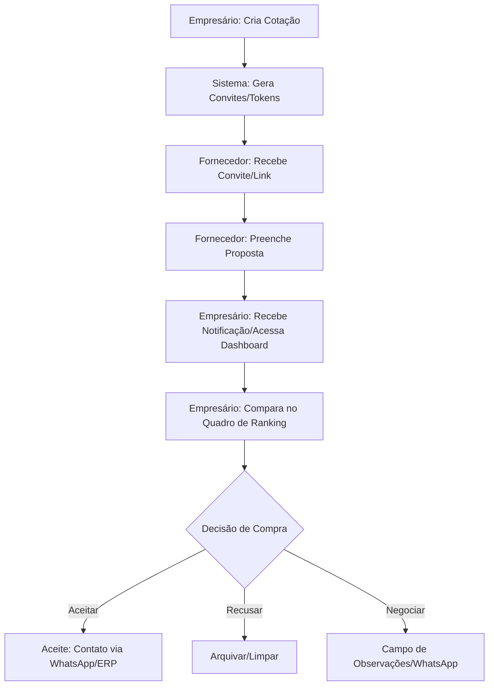

# Análise do Fluxo de Cotação: Venda Mais

Esta análise provê uma visão 360º do ecossistema de cotações, cobrindo desde a intenção de compra do empresário até a negociação final com o fornecedor.

---

## 1. Personas e Papéis

### 👤 Empresário (Owner/Admin)
*   **Objetivo**: Obter o melhor custo-benefício para reposição de estoque.
*   **Responsabilidades**: Criar cotações, selecionar fornecedores, analisar rankings de preços, definir margens de lucro e decidir pela compra (aceite de proposta).

### 🚛 Fornecedor (Participant)
*   **Objetivo**: Vender produtos em volume com margens competitivas.
*   **Responsabilidades**: Responder a solicitações de cotação com preços, prazos e observações técnicas; acompanhar o status de suas propostas.

---

## 2. Fluxo Técnico: Ciclo de Vida da Cotação

### Detalhes das Etapas:

1.  **Criação (Empresário -> Fornecedor)**:
    *   O empresário seleciona itens (muitas vezes puxados de uma base de produtos pré-existente) e define os fornecedores-alvo.
    *   **Inovação**: Uso de tokens para acesso sem necessidade de login complexo pelo fornecedor no primeiro contato (`/convite/[token]`).

2.  **Resposta (Fornecedor -> Empresário)**:
    *   O fornecedor preenche o formulário de proposta (`/proposta/[token]`).
    *   Pode incluir observações por item (ex: "produto similar", "falta estoque", "entrega em 3 dias").

3.  **Análise e Comparação (Empresário)**:
    *   **Dashboard de Ranking**: O sistema calcula automaticamente o "Melhor Preço", aplica pontuações (Scoring Rules) baseadas em ranking (1º lugar ganha mais pontos) e exibe o histórico de preços.
    *   **Motor de Margem**: O empresário simula o preço de venda na loja instantaneamente ao ajustar a margem (`DEFAULT_MARGIN_PERCENT`).

---

## 3. O "Elo de Ligação" (Bridge) e Contato Direto

O sistema não é apenas um repositório de dados, mas um facilitador de negociação:

*   **Integração com WhatsApp**: Localizada no dashboard de detalhes (`CotacaoDetalhesClient.tsx`), permite que o empresário envie um resumo estruturado da proposta para o fornecedor com um clique. Isso transita a negociação "fria" (dados) para uma negociação "quente" (conversa).
*   **Observações de Negociação**: Fornecedores podem deixar notas que alertam o empresário sobre condições especiais, criando um log de intenções.

---

## 4. Engenharia de Prompt para Futuras Funcionalidades

Para orientar o desenvolvimento de novas features via IA, os prompts devem considerar o contexto abaixo:

### Matriz de Contexto para LLMs:
> "Você está atuando no sistema **Venda Mais**, uma plataforma de e-procurement B2B. O sistema utiliza Next.js, Supabase (RLS habilitado) e Tailwind. A estrutura de dados principal envolve `cotacoes`, `propostas`, `profiles` e `proposta_itens`. O sucesso do usuário é definido pela economia de tempo na comparação e precisão na margem de lucro."

### Sugestões de Próximas Features (Prompt Ready):

1.  **IA de Sugestão de Fornecedores**:
    *   *Prompt Concept*: "Analise o histórico de `@cotacoes` e `@fornecedores` passados e sugira quais fornecedores têm maior probabilidade de vencer a cotação atual baseada na `@categoria` dos produtos."
2.  **Dashboard de Análise de Variância (Inflação Interna)**:
    *   *Prompt Concept*: "Crie um componente que compare o `@valor_total` das propostas aceitas nos últimos 6 meses para o mesmo `@produto`, gerando um gráfico de tendência de preço (saving vs loss)."
3.  **Automação de Follow-up via WhatsApp**:
    *   *Prompt Concept*: "Implemente um cron job (ou edge function) que identifique propostas pendentes (`status: enviada` mas sem itens) e gere um link de WhatsApp com mensagem de lembrete personalizada para o `@fornecedor`."
4.  **Negociação em Bloco (Lote)**:
    *   *Prompt Concept*: "Permita que o empresário selecione múltiplos itens de diferentes fornecedores (o 'Carrinho do Ganhador') e gere uma ordem de compra consolidada, otimizando o frete."

---

## 5. Análise de Lacunas (Gap Analysis)

*   **Feedback ao Fornecedor**: Atualmente, o fluxo é muito focado no empresário. O fornecedor ganha pouco valor além de responder. *Insight*: Criar um dashboard para o fornecedor ver seu "Market Share" dentro das cotações daquele empresário.
*   **Integração Logística**: O campo `prazo_entrega` existe no tipo, mas não é explorado visualmente no ranking de forma tão forte quanto o preço.

---

> [!TIP]
> **Reflexão Estratégica**: O sistema está pronto para escalar de um "Comparador de Preços" para um "Gestor de Compras Inteligente". O foco deve ser reduzir o trabalho manual de "copia e cola" de preços e aumentar a agência do empresário na tomada de decisão baseada em dados históricos.
