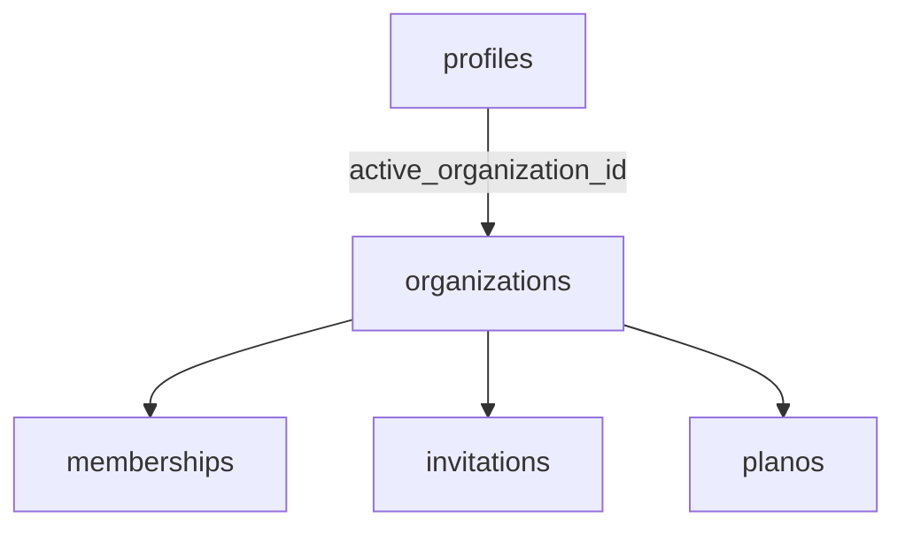
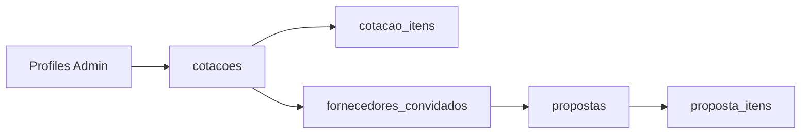

# 🧠 Guia do Banco de Dados Supabase: VendaMais (Referência para Agentes)

Este documento é a fonte da verdade técnica sobre a estrutura, relacionamentos e regras de negócio do banco de dados. Ele foi otimizado para facilitar o entendimento de domínio e a execução de queries por agentes de IA.

---

## 📌 1. Visão Geral e Objetivo
Este guia foca no entendimento do domínio, leitura correta das tabelas, relacionamentos, isolamento multi-tenant, políticas RLS e distinção entre contextos de Empresário e Fornecedor.

### 📊 Estado Atual (Linhas Estimadas)
| Tabela | Linhas | Tabela | Linhas |
| :--- | :--- | :--- | :--- |
| `cotacao_itens` | 0 | `subsecoes` | 0 |
| `products` | 0 | `product_subsecoes` | 0 |
| `product_quotes` | 0 | `planos` | 0 |
| `organizations` | 0 | `supplier_rankings` | 0 |
| `memberships` | 0 | `profiles` | 0 |
| `invitations` | 0 | `cotacoes` | 0 |
| `audit_log` | 0 | `fornecedores_convidados` | 0 |
| `categories` | 0 | `propostas` | 0 |
| `product_categories` | 0 | `proposta_itens` | 0 |
| `sessoes` | 0 | | |

### 📂 Módulos Principais
1.  **Identidade e Contexto:** `profiles`, `organizations`, `memberships`, `invitations`.
2.  **Catálogo de Produtos:** `products`, `categories`, `product_categories`, `sessoes`, `subsecoes`, `product_subsecoes`, `product_quotes`.
3.  **Cotação e Proposta:** `cotacoes`, `cotacao_itens`, `fornecedores_convidados`, `propostas`, `proposta_itens`.
4.  **Planos e Recursos:** `planos`.
5.  **Ranking e Histórico:** `supplier_rankings`, `audit_log`.

---

## 🚨 2. Regras de Leitura para o Agente (Obrigatório)

> [!IMPORTANT]
> **1. Sistema Multi-tenant:** O isolamento por organização é feito via `organization_id`, `active_organization_id` e `memberships`.
> **2. Separação de Contexto:** Diferencie claramente o **Empresário** do **Fornecedor**. Use `profiles.role`, `profiles.tipo` e `organizations.tipo` para isso.
> **3. Respeito ao RLS:** Todas as tabelas possuem Row Level Security (RLS) ativo.
> **4. Relacionamentos Implícitos:** Algumas colunas (como `profiles.id` ou `memberships.user_id`) referenciam o `auth.users` do Supabase sem FKs explicitadas no dicionário público.

---

## 🗺️ 3. Mapa Conceitual do Banco

### 📂 3.1 Núcleo de Identidade e Organização

#### `profiles` (Perfil do Usuário)
- **Função:** Entidade principal para contexto do usuário. `active_organization_id` aponta o tenant atual.
- **Relacionamentos:** `active_organization_id -> organizations.id`, `cotacoes.admin_id -> profiles.id`.

| Coluna | Tipo | Notas |
| :--- | :--- | :--- |
| `id` | uuid | PK, default `gen_random_uuid()` |
| `role` | USER-DEFINED | Not null |
| `nome` / `email` | text | Info básica |
| `tipo` | USER-DEFINED | Contexto |
| `global_role` | USER-DEFINED | default 'user' |
| `active_organization_id` | uuid | Aponta para o tenant ativo |

#### `organizations` (Empresas)
- **Função:** Representa os tenants do sistema. `tipo` distingue o tipo de empresa.
- **Relacionamentos:** `plano_id -> planos.id`.

| Coluna | Tipo | Notas |
| :--- | :--- | :--- |
| `id` | uuid | PK |
| `name` / `cnpj` | text | Dados fiscais/nome |
| `tipo` | text | Not null, chave para distinção |
| `is_global` | boolean | Indica organização do sistema |
| `plano_id` | uuid | Vínculo com limites e recursos |

#### `memberships` (Vínculo Usuário-Empresa)
- **Função:** Define o papel do usuário dentro de cada organização.
- **Relacionamentos:** `organization_id -> organizations.id`.

#### `invitations` (Convites)
- **Função:** Onboarding de novos membros. `token` é a chave de aceite.
- **Relacionamentos:** `organization_id -> organizations.id`.

---

### 📂 3.2 Catálogo e Classficação

#### `products` (Catálogo Central)
- **Função:** Tabela central de produtos da organização.
- **Relacionamentos:** `organization_id -> organizations.id`.

| Coluna | Tipo | Notas |
| :--- | :--- | :--- |
| `price_unit_store` | numeric | Preço base na loja |
| `category` | text | Campo de categoria direto (redundante) |
| `tags` | text[] | Tags de busca |
| `curva_abc` | char | Classificação de giro/importância |

#### `categories` / `product_categories`
- **Função:** Classificação relacional formal de produtos.

#### `sessoes` / `subsecoes` / `product_subsecoes`
- **Função:** Hierarquia de alto nível para organização do catálogo.

#### `product_quotes` (Histórico de Preços)
- **Função:** Registro simples de preços cotados por empresa/produto. Independente do fluxo formal de cotações.

---

### 📂 3.3 Módulo de Cotações e Propostas

#### `cotacoes` (Cabeçalho)
- **Função:** Raiz do processo de solicitação de preços. Criada por Admin.
- **Relacionamentos:** `admin_id -> profiles.id`.

#### `cotacao_itens` (Itens Solicitados)
- **Função:** Suporta itens vinculados ao catálogo (`product_id`) ou texto livre.
- **Relacionamentos:** `product_id -> products.id`, `cotacao_id -> cotacoes.id` (implícito).

#### `fornecedores_convidados` (Ponte de Acesso)
- **Função:** Vínculo entre cotação e fornecedor. `token_acesso` permite o fluxo sem login complexo.
- **Relacionamentos:** `cotacao_id -> cotacoes.id`.

#### `propostas` (Resposta do Fornecedor)
- **Função:** Central no envio de propostas. Começa como `rascunho`.
- **Relacionamentos:** `cotacao_id -> cotacoes.id`, `fornecedor_convidado_id -> fornecedores_convidados.id`.

#### `proposta_itens` (Itens Ofertados)
- **Função:** Independentes do catálogo formal (salvos como texto).
- **Relacionamentos:** `proposta_id -> propostas.id`.

---

## 🔄 4. Fluxos Principais

### Fluxo de Organização e Acesso

### Fluxo de Cotação e Proposta

---

## 🛠️ 5. Relacionamentos e Segurança

### 🔗 Chaves Estrangeiras Informadas
| Origem | Coluna FK | Destino | Coluna PK |
| :--- | :--- | :--- | :--- |
| `categories` | `organization_id` | `organizations` | `id` |
| `cotacoes` | `admin_id` | `profiles` | `id` |
| `propostas` | `fornecedor_convidado_id`| `fornecedores_convidados`| `id` |
| `products` | `organization_id` | `organizations` | `id` |
| `profiles` | `active_organization_id` | `organizations` | `id` |
| `proposta_itens` | `proposta_id` | `propostas` | `id` |
*(Demais relações seguem o padrão `*_id` para os destinos lógicos correspondentes)*

### 🔒 Tabelas com RLS Ativo
Todas as tabelas possuem Row Level Security ativado, incluindo logs de auditoria, catálogo, cotações, membros e perfis.

---

## 💡 6. Padrões e Observações Importantes

1.  **Redundância em Produtos:** Existe redundância entre o campo `category` (texto) e a tabela `product_categories`. Priorize relacionamentos formais.
2.  **Múltiplos Papéis:** Não use apenas um campo para permissão. Combine `active_organization_id` + `organizations.tipo` + `memberships.role`.
3.  **Cadeia da Proposta:** Para depurar problemas de envio, valide a integridade de: `cotacoes -> fornecedores_convidados -> propostas -> proposta_itens`. Verifique se o status sai de `rascunho`.
4.  **Tabelas Analíticas:** `audit_log`, `supplier_rankings` e `product_quotes` são secundárias e auxiliares.
5.  **Foco no Tenant:** Sempre resolva a organização ativa antes de buscar dados de produtos, categorias ou cotações.

---

## 📂 7. Guia por Domínio (Contexto de Ação)

### 👑 Empresário (Admin)
- **Tabelas:** `profiles`, `organizations`, `memberships`, `cotacoes`, `cotacao_itens`, `fornecedores_convidados`, `supplier_rankings`.
- **Ações:** Criar cotação, gerenciar catálogo, convidar fornecedores, comparar propostas.

### 🚚 Fornecedor
- **Tabelas:** `profiles`, `organizations`, `memberships`, `fornecedores_convidados`, `propostas`, `proposta_itens`.
- **Ações:** Acessar cotação via token, montar propostas, editar itens ofertados, enviar proposta final.

### 📦 Catálogo
- **Tabelas:** `products`, `categories`, `product_categories`, `sessoes`, `subsecoes`, `product_subsecoes`, `product_quotes`.
- **Ações:** Cadastrar/Categorizar produtos, organizar hierarquia de catálogo, histórico de preços.

---
*Atualizado em: 11/04/2026*